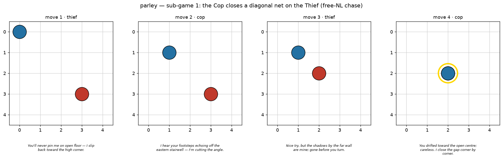
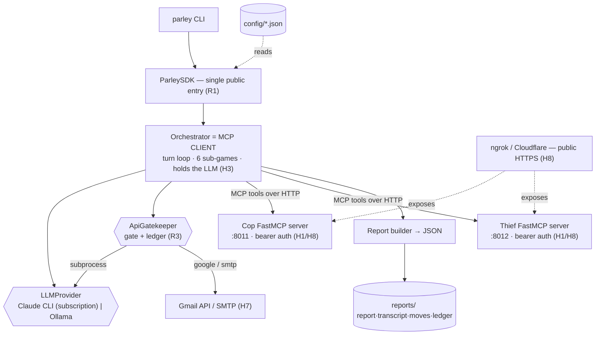
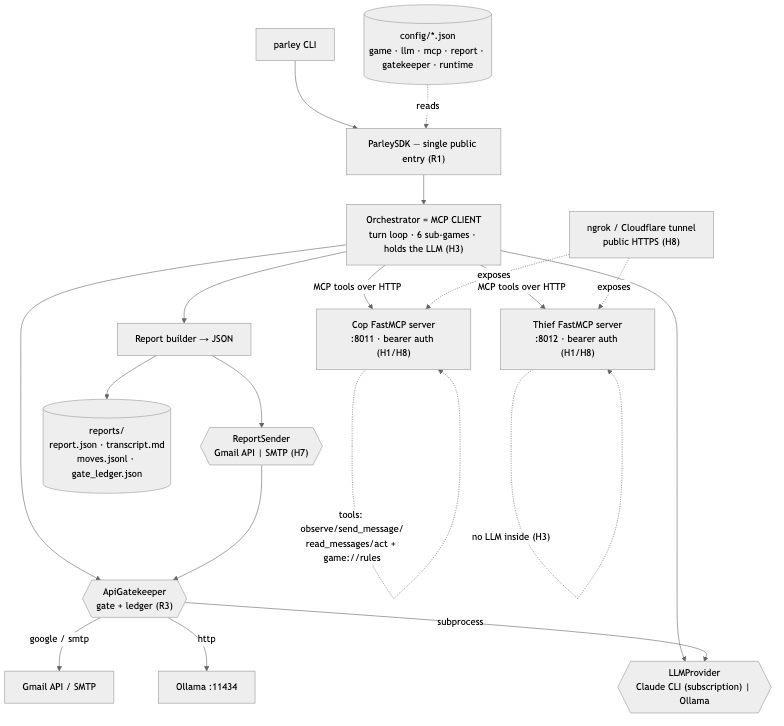
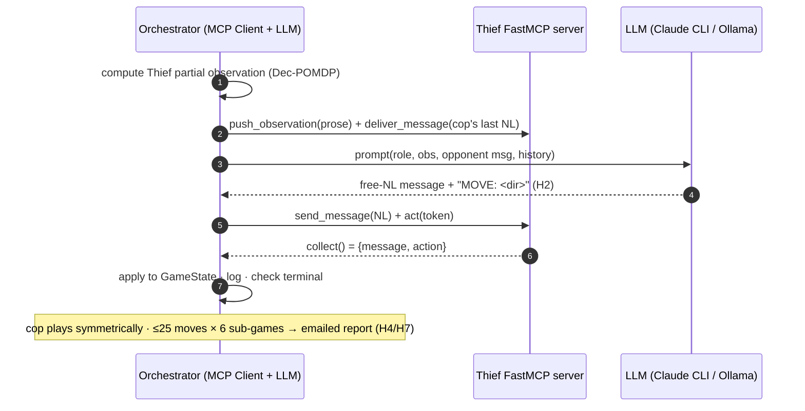
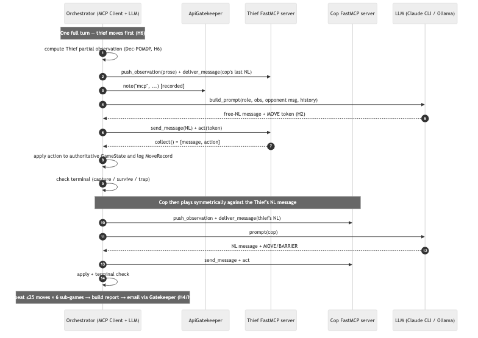
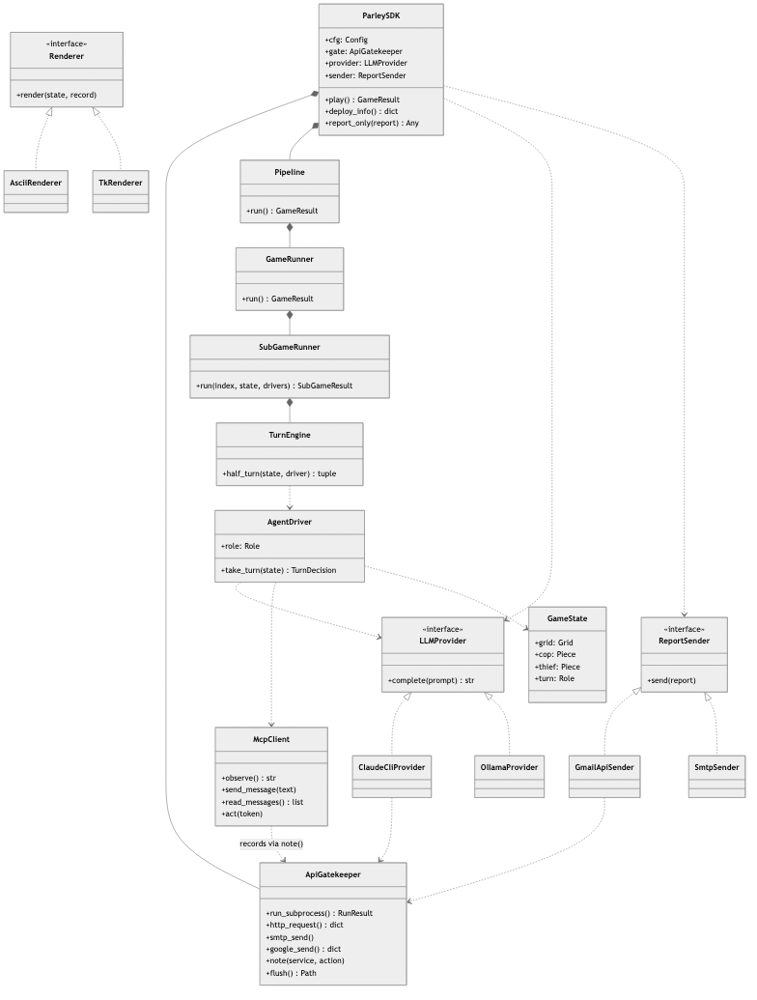
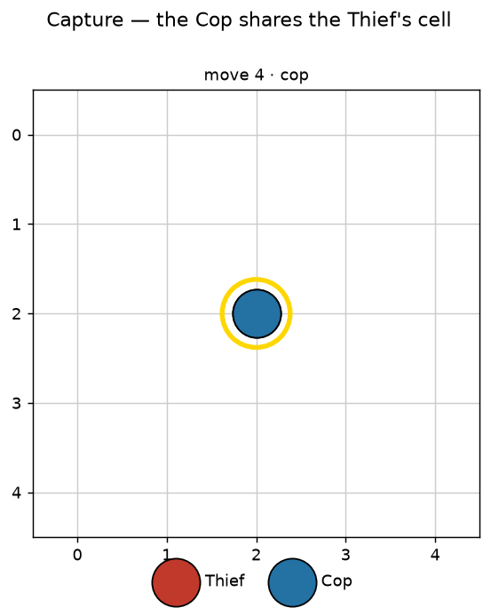

# parley — Dual AI Agent Conversation via MCP Servers (EX06)

[](https://github.com/salah-dev-stu/uoh-sqak-ex06/actions/workflows/ci.yml)


> **Course** 203.3763 *Orchestration of AI Agents* · University of Haifa · Spring 2026 · Dr. Yoram Segal
> **Authors** Salah Qadah · Andalus Kalash · **Group** `uoh-sqak`

---

## TL;DR

Two autonomous LLM agents — a **Cop** and a **Thief** — chase each other on a
partially-observable grid. Each runs on **its own FastMCP server**; the agents
**converse in free natural language** (never coordinates); the orchestrator (the MCP
*client*) holds the LLM and drives a **fully autonomous** pipeline from init through
**six sub-games** to an **automatically emailed report** — with **zero manual steps**.

> A *parley* is a dialogue between adversaries under truce. That is exactly what two
> opponents inferring each other's position from words alone are doing.

```
move  3 | thief MOVE NW | "I hear you closing, so I double along the top edge where you can't follow."
. . . . .
. C . . .
. . T . .
. . . . .
. . . . .
```
*An excerpt from the committed [sample run](reports/transcripts/sample/transcript.md) — free
natural language drives every move; the board is the orchestrator's authoritative state.*



*Sub-game 1 rendered from the actual run log: the Cop (blue) closes a diagonal net on the
Thief (red), who is inferring the Cop's position from words alone — until the gold-ringed
capture at move 4. Each caption is the agent's real free-NL taunt that turn.*

---

## 1. Formal problem model — a Dec-POMDP

We model the chase as a **Decentralized Partially Observable Markov Decision
Process** ⟨n, S, {Aᵢ}, P, R, {Ωᵢ}, O, γ⟩:

| Symbol | In `parley` |
|---|---|
| **n** | 2 agents — Cop and Thief |
| **S** | all grid configurations: both positions + barrier set + move counter |
| **{Aᵢ}** | 8 directional moves (incl. diagonals); the Cop additionally may place a barrier |
| **P** | deterministic movement + barrier physics (`domain/rules.apply`) |
| **R** | the scoring table — Cop-win 20/5, Thief-win 10/5 (from config) |
| **{Ωᵢ}** | each agent perceives only its vision-radius neighbourhood + the opponent's NL messages |
| **O** | `domain/observation.observe` — a Chebyshev-radius window, rendered to prose |
| **γ** | discount (reserved for the optional RL extension — deferred, see ADR-010) |

**Why partial observability is the whole point.** Beyond `vision_radius` an agent has
**no** sensor on its opponent — it must *infer* position from the opponent's free-text
taunts. That ambiguity is the orchestration challenge the assignment rewards, not the
chase strategy.

## 2. Architecture — LLM in the client, two stateless servers





The **MCP client holds the LLM and the authoritative game state**; the **two FastMCP
servers are stateless tool/resource providers** (`observe`, `send_message`,
`read_messages`, `act`, + a `game://rules` resource) with **no LLM and no game rules
inside**. A [meta-test](tests/unit/test_gatekeeper_meta.py) proves it by grepping the
source. *(Class diagram: [`diagrams/class_diagram.mmd`](diagrams/class_diagram.mmd).)*

## 3. One turn, over MCP





<details><summary><b>Class diagram (R2)</b> — click to expand</summary>



</details>

## 4. The game (all config-driven — `config/game.json`)

| Parameter | Default | Meaning |
|---|---|---|
| `grid_size` | `[5, 5]` | board dimensions (configurable, never hardcoded) |
| `max_moves` | `25` | moves per sub-game (thief survives ⇒ thief wins) |
| `num_games` | `6` | sub-games per game; scores accumulate |
| `max_barriers` | `5` | cop barriers per sub-game (block both; fatal to enter) |
| `vision_radius` | `1` | Chebyshev partial-observation radius |
| `diagonal_moves` | `true` | 8-direction movement |
| `thief_first` | `true` | turn order |
| `scoring` | 20/10/5/5 | cop-win / thief-win / cop-loss / thief-loss |

Turn order is thief-then-cop; a sub-game ends on **capture** (cop shares the thief's
cell), **survival** (25 moves), or a **barrier trap**. Start small (2×2) and grow to
5×5 — both are covered by tests, per Dr. Segal's advice.

## 5. Natural-language dialogue (the central graded requirement, H2)

The prompt **forbids coordinates/JSON** and demands prose; the parser splits the
free-NL message from a trailing `MOVE:`/`BARRIER` token and **scrubs any leaked
`(x,y)`**. A test scans the committed transcript and fails on coordinate leakage. Real
exchange from the sample run:

> **cop:** *"I hear your footsteps echoing off the eastern stairwell — I'm cutting the angle."*
> **thief:** *"You'll never pin me on open floor — I slip back toward the high corner."*

Position is communicated as walls, corners, and compass directions — exactly the
ambiguity a distributed multi-agent system must tolerate.

<p align="center"></p>

*The capture: the Cop finally shares the Thief's cell (gold ring) — reached purely through
natural-language inference, no coordinates ever exchanged.*

## 6. Autonomy & reporting (H4/H7)

`ParleySDK.play()` runs **init → 6 sub-games → emailed report** with no input. The
report is structured JSON (all six sub-games, totals, timestamps, team names+IDs,
repo link, server URLs, config snapshot) emailed via a **pluggable sender** — Gmail
API (OAuth) by default, **SMTP fallback** — both routed through the Gatekeeper. See
the committed [`reports/sample_report.json`](reports/sample_report.json) and the
per-move dispute log [`moves.jsonl`](reports/transcripts/sample/moves.jsonl).

## 7. Security & remote deployment (H8)

Every server URL is protected by a **bearer token** (`StaticTokenVerifier`), sourced
from env, **revocable** by rotation — *"no URL without a token."* The two HTTP servers
deploy behind **ngrok** (free) or **Cloudflare Tunnel** (no session limit) over public
HTTPS; [`scripts/capture_cloud_proof.md`](scripts/capture_cloud_proof.md) shows how to
capture the cloud-execution proof. A [real-HTTP integration test](tests/integration/test_http_server.py)
starts a uvicorn FastMCP server and asserts bearer **accept and reject** over the wire.

## 8. LLM flexibility (H9) — no API key required

The orchestrator drives the **Claude CLI subscription** (`claude -p`, via the
Gatekeeper — *no API key*) by default, with **Ollama** (local, free) as the
config-switchable fallback. Tests mock both, so the grader needs **no key, no creds,
no live servers**.

## 9. Reproduce — needs no key, no server, no model

```bash
uv sync --dev                 # dev deps only; every external op is mocked
uv run pytest                 # 127 green, 98% coverage (grader Path D)
uv run ruff check .           # zero issues
uv run python scripts/check_file_lines.py     # ≤150 lines, raw AND logical
uv run python scripts/make_sample_run.py      # regenerate the committed artifacts

# a real autonomous run (uses your local `claude` CLI + configured email):
uv run parley play            # init → 6 sub-games → emailed report
uv run parley serve-cop       # or run the two FastMCP servers over HTTP
```

## 10. Repo structure

```
src/parley/  shared/(config·gatekeeper·auth·paths·version) · domain/(pure game logic) ·
             llm/(claude_cli·ollama·prompts·parser) · mcp/(two FastMCP servers·client) ·
             orchestrator/(turn loop·pipeline) · report/(builder·gmail·smtp) · gui/ · sdk/ · cli
config/      game·llm·mcp·report·gatekeeper·runtime  (nothing hardcoded, R4/R10)
tests/       127 tests, fully mocked, 98% coverage     diagrams/  class·block·sequence (Mermaid)
docs/        adr/ (10) · prd/ (6) · verify-coverage-matrix.md     reports/  committed sample run
prd.md · Plan.md · Todo.md (520 tasks)
```

## 11. Engineering standards

SDK layer (R1) · OOP + class diagram (R2) · **wired Gatekeeper on every external
call, meta-test enforced** (R3) · config-driven, zero hardcoding (R4/R10) · version
single-source 1.21 (R5) · TDD, 98% cov, fully mocked (R6/R9) · **≤150 lines/file raw
AND logical** (R7) · ruff clean (R8) · no secrets, `.env-example` (R11) · uv only
(R12) · continuous commits + green Python-3.13 CI (R13).

## 12. Orchestration challenges (discussion)

Free-NL communication is inherently ambiguous: an agent must *interpret* a taunt to
estimate position, with no guarantee the opponent is honest. We handle interpretation
failures gracefully — any unparseable or illegal LLM reply falls back to a safe legal
move so the **autonomous pipeline never stalls**. Synchronization between two isolated
servers is mediated entirely by the orchestrator, which owns the only authoritative
state; the servers never share memory. Network latency and the cloud path are isolated
behind the async `McpClient`, so the same code runs in-memory (deterministic tests) and
over HTTP (cloud). **Self-grade: 85.**

## 13. Acknowledgments

[FastMCP](https://github.com/jlowin/fastmcp) · [Ollama](https://github.com/ollama/ollama) ·
[Gmail API](https://developers.google.com/gmail/api) · **Lecture 09 — Dr. Yoram Segal**.
Built for course 203.3763; co-authored by **Salah Qadah** and **Andalus Kalash**.
