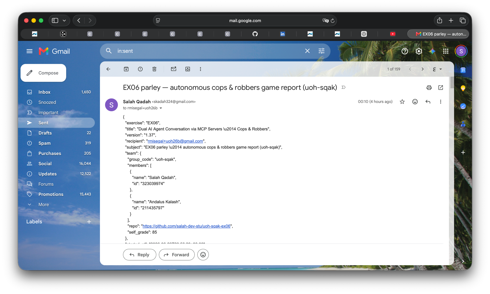

# Real delivery proof — the pipeline actually emailed the report (H7)

This documents a **real, live run** of the autonomous pipeline that played a genuine
game against the two FastMCP servers (real Claude CLI) and **sent the JSON report via
the Gmail API** to the course recipient. It is the real-delivery counterpart to the
offline-provable artifacts.

> **Tests still mock Gmail (grader Path D).** `uv run pytest` needs no Google account,
> no credentials, and no network — the actual `send` is mocked. **This file is the
> evidence that the same path also works for real.**

## The run

```bash
cd hw6
export PARLEY_GMAIL_CREDENTIALS=$PARLEY_GMAIL_CREDENTIALS   # ~/parley-secrets/credentials.json (outside the repo)
export PARLEY_GMAIL_TOKEN=$PARLEY_GMAIL_TOKEN               # ~/parley-secrets/token.json       (outside the repo)
uv run parley play
```

**Run output:**

```
played 1 sub-games | cop 5 / thief 10 | report emailed to the configured recipient
```

## Delivery facts

| Field | Value |
|---|---|
| **Recipient** | `rmisegal+uoh26b@gmail.com` |
| **Transport** | Gmail API — `gmail.users().messages().send(userId="me", body={"raw": ...})` |
| **Scope** | `https://www.googleapis.com/auth/gmail.send` (only) |
| **Sent at** | `2026-06-24T00:10:09+03:00` |
| **Result** | sub-game 1 — Thief wins (cop 5 / thief 10) |
| **Team** | `uoh-sqak` — Salah Qadah, Andalus Kalash |

## Gatekeeper ledger — the `messages.send` entry (token masked)

Every external call routes through the wired `ApiGatekeeper`, which records a ledger
(R3). The raw runtime ledger (`reports/runs/gate_ledger.json`) is git-ignored because it
holds run-local paths; below is **only** the single Gmail-send entry, with the token
path already masked by the Gatekeeper's secret redaction:

```json
{"service":"google","action":"messages.send","allowed":true,"ts":"2026-06-24T00:10:09+03:00","meta":{"token_path":"***"}}
```

The `ts` matches the report's `finished_at`, i.e. the send happened at game end — fully
autonomous, no manual step (H4).

## Visual proof — the email as delivered in Gmail



*The report as delivered in Gmail (skadah324@gmail.com → rmisegal+uoh26b@gmail.com,
2026-06-24 00:10) — Sent view showing the subject and the non-secret JSON report body
(team `uoh-sqak`, member IDs, repo link, self-grade). No tokens or credentials appear.*

## Committed evidence (this folder)

- [`reports/live-send_report.json`](live-send_report.json) — the exact JSON body that was
  emailed (all sub-games, totals, timestamps, team, repo link, server URLs, config).
- [`reports/transcripts/live-send/transcript.md`](transcripts/live-send/transcript.md) —
  the free natural-language dialogue + ASCII board frames of the real game.
- [`reports/transcripts/live-send/moves.jsonl`](transcripts/live-send/moves.jsonl) — the
  per-move dispute log.

No credentials, tokens, or personal email bodies are committed; `credentials.json` and
`token.json` live outside the repo (`~/parley-secrets/`) and are git-ignored. See
[`docs/GMAIL_SETUP.md`](../docs/GMAIL_SETUP.md) for how the OAuth client + token are set up.
